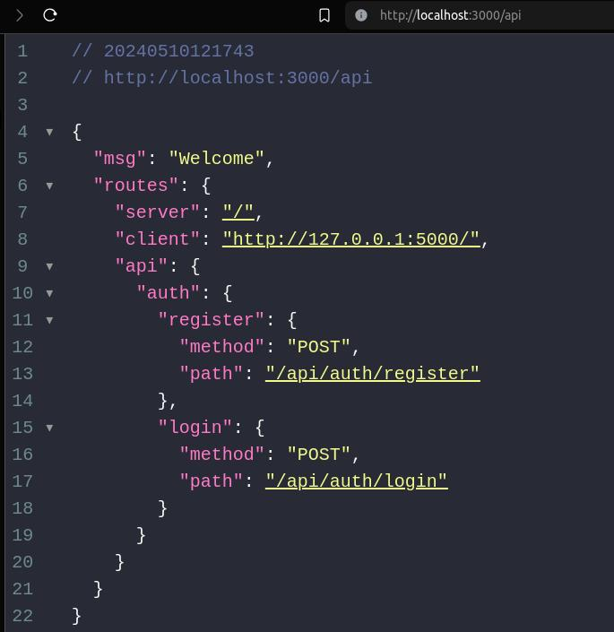

<h1 align="center">Application Tracking System</h1>

<p  align="center">
Making sense of all the incoming applicationa for job listings is tideous. It solves by providing a UI with extremely powerful API.
Manage Job Postings, Applications, Hire the bests.
</p>

### Features

-   **[Suite](./assets/idea.md)**

### Technologies

-   **Node**
-   **Express**
-   **MongoDB**

### Installation

```bash
$ git clone https://github.com/axyut/applicant_tracking_system.git
$ cd applicant_tracking_system
$ npm install
$ npm start
```

`Visit http://localhost:3000/api to see the API Resources.`



## api

`Client/Applicant UI Endpoints:`

1. **Job Submission:**
    - `POST /api/jobs/submit`: Submit a job application.
2. **Captcha Verification:**
    - `POST /api/captcha/verify`: Verify the captcha.

`Admin UI Endpoints:`

1. **View Applications:**
    - `GET /api/admin/applications`: Get all applications.
    - `GET /api/admin/applications/:id`: Get details of a specific application.
2. **Manage Applications:**

    - `PUT /api/admin/applications/:id/status`: Update application status (e.g., In-Review, Rejected, Hired).

3. **Manage Job Postings:**

    - `GET /api/admin/job-postings`: Get all job postings.
    - `POST /api/admin/job-postings`: Create a new job posting.
    - `PUT /api/admin/job-postings/:id`: Update an existing job posting.
    - `DELETE /api/admin/job-postings/:id`: Delete a job posting.

4. **Manage Profiles:**

    - `GET /api/admin/profiles/:id`: Get admin profile details.
    - `PUT /api/admin/profiles/:id`: Update admin profile.

5. **Manage Payments:**

    - `GET /api/admin/payments`: Get payment details.
    - `POST /api/admin/payments`: Make a payment.
    - `PUT /api/admin/payments/:id`: Update payment details.
    - `DELETE /api/admin/payments/:id`: Cancel a payment.

6. **Manage Projects:**

    - `GET /api/admin/projects`: Get all projects.
    - `POST /api/admin/projects`: Create a new project.
    - `PUT /api/admin/projects/:id`: Update an existing project.
    - `DELETE /api/admin/projects/:id`: Delete a project.

7. **Manage Teams:**

    - `GET /api/admin/teams`: Get all teams.
    - `POST /api/admin/teams`: Create a new team.
    - `PUT /api/admin/teams/:id`: Update an existing team.
    - `DELETE /api/admin/teams/:id`: Delete a team.

8. **Manage Goals:**

    - `GET /api/admin/goals`: Get all goals.
    - `POST /api/admin/goals`: Create a new goal.
    - `PUT /api/admin/goals/:id`: Update an existing goal.
    - `DELETE /api/admin/goals/:id`: Delete a goal.

9. **View History/Timeline:**

    - `GET /api/admin/history/applications`: Get application history.
    - `GET /api/admin/history/projects`: Get project history.
    - `GET /api/admin/history/employees`: Get employee history.

10. **Settings:**
    - `GET /api/admin/settings`: Get admin settings.
    - `PUT /api/admin/settings`: Update admin settings.

`Authentication Endpoints:`

1. **Authentication:**

    - `POST /api/auth/login`: Login.
    - `POST /api/auth/logout`: Logout.

2. **Registration:**
    - `POST /api/auth/register`: Register a new user.

`Batch Management Endpoints:`

1. **Manage Batches:**
    - `GET /api/admin/batches`: Get all batches.
    - `POST /api/admin/batches`: Create a new batch.
    - `PUT /api/admin/batches/:id`: Update an existing batch.
    - `DELETE /api/admin/batches/:id`: Delete a batch.
    - `PUT /api/admin/batches/:id/current`: Set a batch as the current batch.

`Permissions Management Endpoints:`

1. **Manage Roles:**

    - `GET /api/admin/roles`: Get all roles.
    - `POST /api/admin/roles`: Create a new role.
    - `PUT /api/admin/roles/:id`: Update an existing role.
    - `DELETE /api/admin/roles/:id`: Delete a role.

2. **Assign Permissions to Roles:**

    - `PUT /api/admin/roles/:roleId/permissions`: Assign permissions to a role.
    - `DELETE /api/admin/roles/:roleId/permissions/:permissionId`: Remove a permission from a role.

3. **Manage Permissions:**
    - `GET /api/admin/permissions`: Get all permissions.
    - `POST /api/admin/permissions`: Create a new permission.
    - `PUT /api/admin/permissions/:id`: Update an existing permission.
    - `DELETE /api/admin/permissions/:id`: Delete a permission.

` generated by chatgpt based on the above admin ui plan input`
